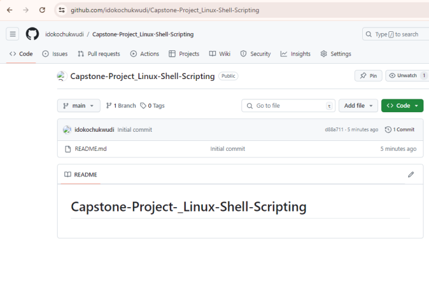
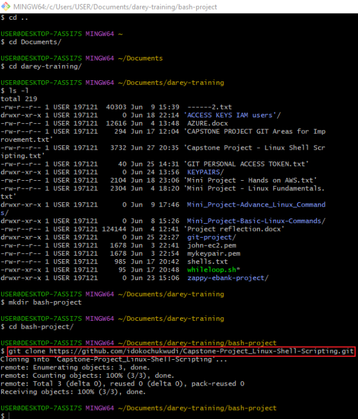
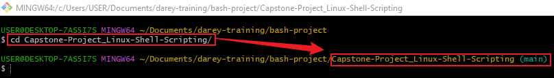
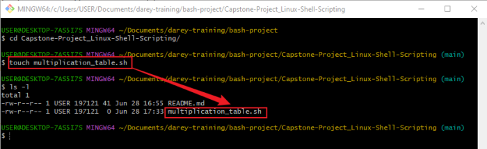
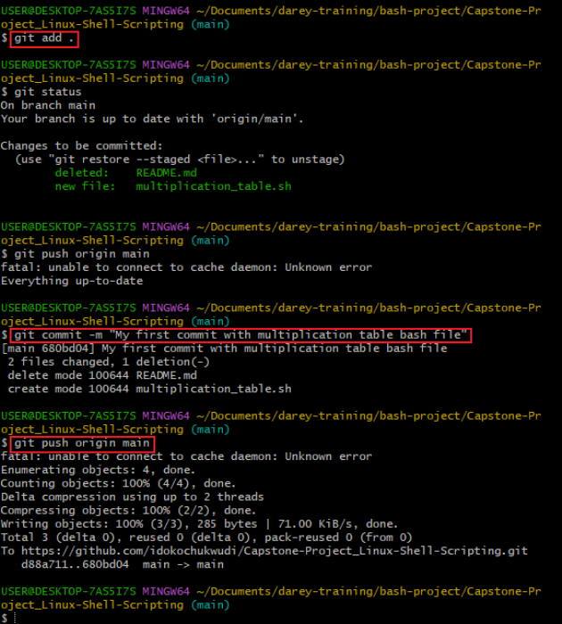
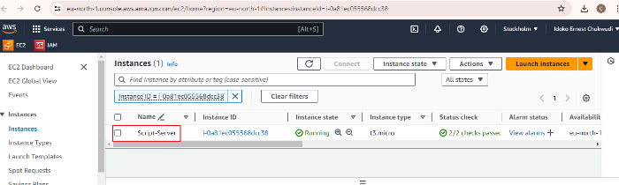
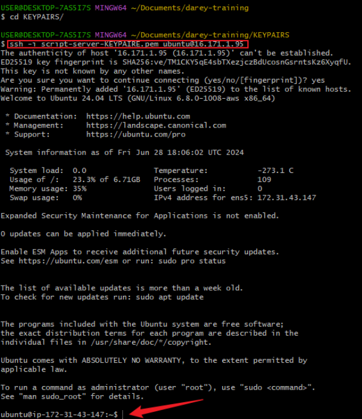
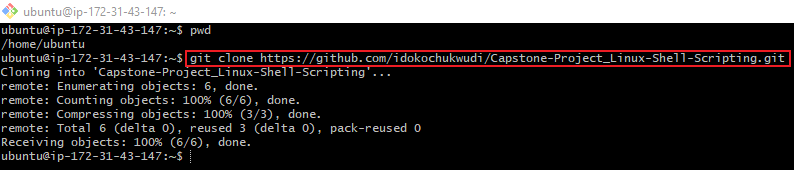
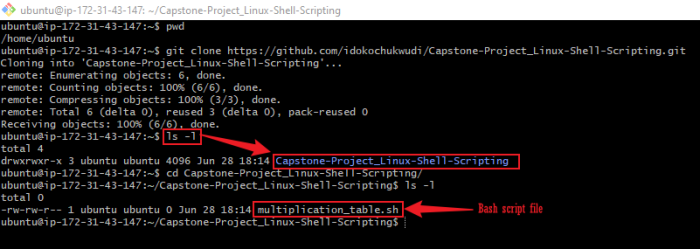
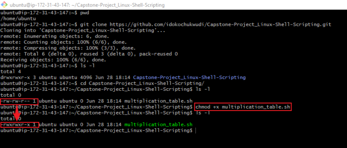

## Capstone Project - Linux Shell Scripting

### Introduction:
The Capstone Project in Linux Shell Scripting is designed to create a practical, user-friendly Bash script that generates multiplication tables. This project emphasizes the importance of using different loop constructs, such as list form and C-style for loops, to achieve the desired functionality. By combining these techniques, the project aims to enhance the user's understanding of loop structures in Bash and demonstrate effective script development practices.

### Objective: 
The project aims to develop a Bash script capable of generating a multiplication table for a user-specified number. The script will prompt the user for input and then display the multiplication table up to 10, using both list form and C-style for loops to achieve this.

### Tools Utilized
1. **GitHub:** For repository management and collaboration.

2. **Git:** For terminal commands.

3. **Visual Studio Code and Markdown:** For documentation.

4. **AWS EC2 Instance:** For running the script in a cloud environment.

### Project Workflow
The project will follow a structured workflow to ensure efficient development and deployment of the Bash script. It begins with creating a GitHub repository to manage the project files, followed by cloning the repository to the local machine for development. After creating and editing the Bash script, updates are pushed to GitHub. An AWS EC2 instance is then set up to run the script in a cloud environment, and the repository is cloned onto the EC2 instance to facilitate this.

### 1. Create the Project Repository on GitHub:
- Initialize a new repository to store and manage project files.

    

### 2. Clone the Repository to Local Machine:
- Use Git to clone the repository to my local machine for development.

    

### 3. Navigate to the Cloned Folder:
- Change directories into the cloned repository folder using the terminal.

    

### 4. Create the Bash Script File:
- Create a file named multiplication_table.sh for the Bash script.

    

### 5. Push Updates to GitHub:
- Commit and push the latest changes to the GitHub repository.

    

### 6. Set Up an AWS EC2 Instance:
- Open my AWS account and create an EC2 instance to run the script.

    

### 7. Connect to the EC2 Instance:
- Use SSH method to connect to my EC2 instance.

    

### 8. Clone the Repository on EC2:
- Clone the GitHub repository into my EC2 instance.

    

### 9. Confirm Repository Clone on EC2:
- Verify that the repository has been successfully cloned.

    

### 10. Make the Script Executable:
- Change the file permissions to make the script executable.

    

### Script Flow

**FUNCTIONS:** To generate multiplication table using list form for loop and using C-style for loop as well as function to prompt the user for input and validate it.

### 1. **`generate_table_list_form:`**
**Reason:** Implements the list form of the for loop to generate the multiplication table.

**Benefit:** Provides an example of a list-based loop, which is straightforward and easy to understand.

### 2. **`generate_table_c_style:`**
**Reason:** Implements the C-style for loop to generate the multiplication table.

**Benefit:** Demonstrates a different loop syntax that is more flexible and closer to traditional programming languages.

### 3. **`prompt_user_input:`**
**Reason:** Centralizes input validation to ensure that the user inputs a valid number.

**Benefit:** Simplifies the main script logic and improves input handling consistency.

### 4. Prompt the user to enter a number for the multiplication table.

**SCRIPT:**

The script first prompts the user to enter a number, which will be used to generate the multiplication table.

**OUTPUT:**

- **Reason:** Requesting a number from the user ensures that the script can dynamically generate a multiplication table for any given number.
- **Benefit:** Enhances the script's flexibility and reusability for various inputs.

### 5. Ask if they want a full table or a partial table (p = partial table, f = full table): If user enter p for partial, prompt for the start and end numbers of the range.

**SCRIPT:**

Users are given the option to choose between a full multiplication table (1 to 10) or a partial table by specifying a range.

**OUTPUT:**

- **Reason:** Providing a choice between a full and partial table allows the user to customize the output.
- **Benefit:** Adds flexibility, making the script more user-friendly and tailored to specific needs.

### 6. Validate the range inputs and handle invalid or out-of-bound entries.

**SCRIPT:**

The script validates the range inputs to ensure they are within acceptable bounds.

- **Reason:** Ensures that the user inputs valid start and end numbers for the range, preventing errors.
- **Benefit:** Increases the script's robustness and provides clear feedback for invalid inputs.

**OUTPUT**
### Example of Correct and Incorrect Range Inputs
**CORRECT RANGE INPUT:** 

This is a correct range because:
1. Both numbers are positive.
2. The start number is less than or equal to the end number.

**INCORRECT RANGE INPUT:** 

This is a correct range because:
The start number is greater than the end number, which makes the range invalid.

### 7. Ask the user for the order of the table (ascending or descending).

**SCRIPT**

Users can choose whether the table is displayed in ascending or descending order.

**Reason:** Allows the user to decide the order in which the multiplication table is displayed.
**Benefit:** Enhances readability and gives users control over the output format.

**OUTPUT**
- Ascending order output

- Descending order output

- Invalid entry output

### 8. Generate and display the multiplication table using both loop styles.
**SCRIPT**

The multiplication table is generated using both list form and C-style for loops, demonstrating different looping techniques.

- **Reason:** Demonstrates both the list form and C-style for loops to show different looping techniques in Bash.
- **Benefit:** Educates users on various loop constructs, providing a comparative understanding.

**OUTPUT**

### 6. Enhance User interaction: Incorporate additional checks or features, like repeating the program for another number without restarting the script.
**SCRIPT**

The script includes features to allow users to generate another table without restarting the script, enhancing efficiency and convenience.

- **Reason:** Allows the user to generate another multiplication table without restarting the script.
- **Benefit:** Increases efficiency and user convenience by enabling multiple operations in a single session.

**OUTPUT**

Output for yes (y)

Output for no (n)

### Conclusion:
This capstone project showcases the development of a versatile and user-friendly Bash script for generating multiplication tables, utilizing both list form and C-style for loops. The project demonstrates effective use of GitHub for collaboration, Git for version control, and AWS EC2 for cloud-based script execution, highlighting best practices in script development and deployment.

